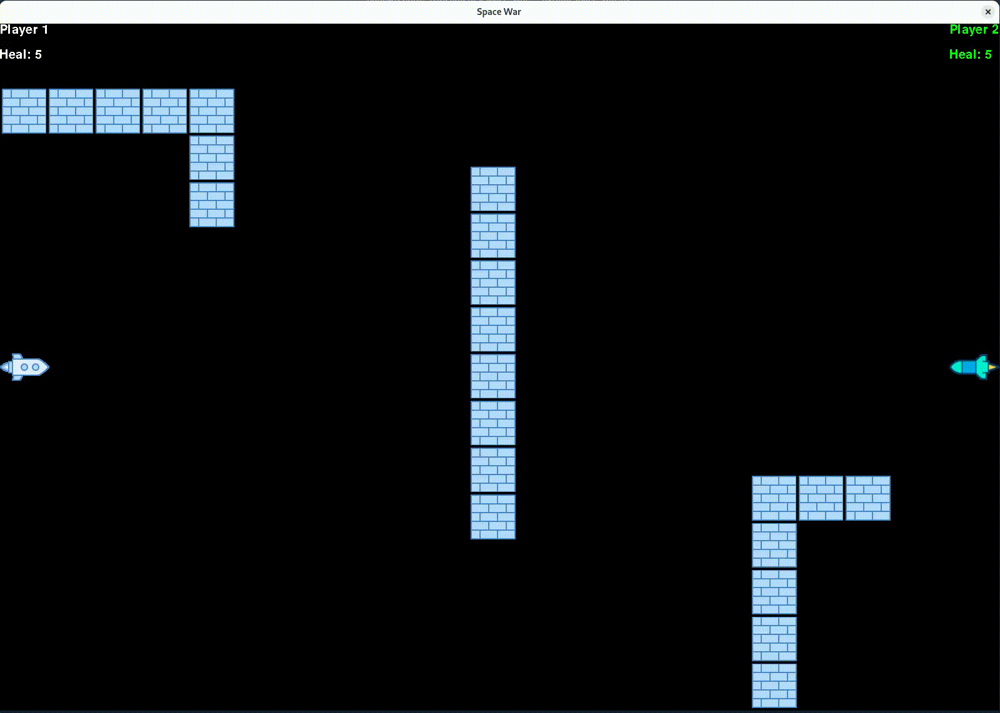

# 🚀 Space War

<p align="center">
  <a href="https://github.com/yourusername/space-war">
    
    
    
  </a>
</p>

## 📸 Gameplay

<p align="center">
  
</p>


## 🎮 How to Play

- This is a **2-player** spaceship shooting game.
- Each player controls a spaceship and tries to shoot the other.
- The first to reach the score limit wins!

### 🕹️ Controls

#### 🚀 Left Spaceship (Player 1)
- Move: `W` `A` `S` `D`
- Shoot: `Spacebar`

#### 🚀 Right Spaceship (Player 2)
- Move: `Arrow Keys`
- Shoot: `Right Ctrl`

## 🛠 Installation

1. Clone the repository
2. Install dependencies
3. Run the game

```bash
git clone git@github.com:xadla/space_war.git
cd space-war
pip install -r requirements.txt
python space_war.py
```

## 🎨 Features

- Two-player local gameplay
- Collision detection and score tracking
- Custom spaceship images and background
- Game sounds and background music

## 📁 Project Structure

```bash
├── assets
│   └── images
│       └── gameplay.gif
├── bullet.py
├── game_music.py
├── images
│   ├── rocket1.png
│   ├── rocket2.png
│   └── wall.png
├── musics
│   └── game.mp3
├── README.md
├── requirements.txt
├── rocket_one.py
├── rocket_two.py
├── score_board.py
├── settings.py
├── space_war.py
└── wall.py
```

## 🙌 Credits

Made with ❤️ by [xadla](https://github.com/xadla)

Thanks to the [Pygame](https://www.pygame.org/) community!

## 📜 License

This project is licensed under the MIT License.
